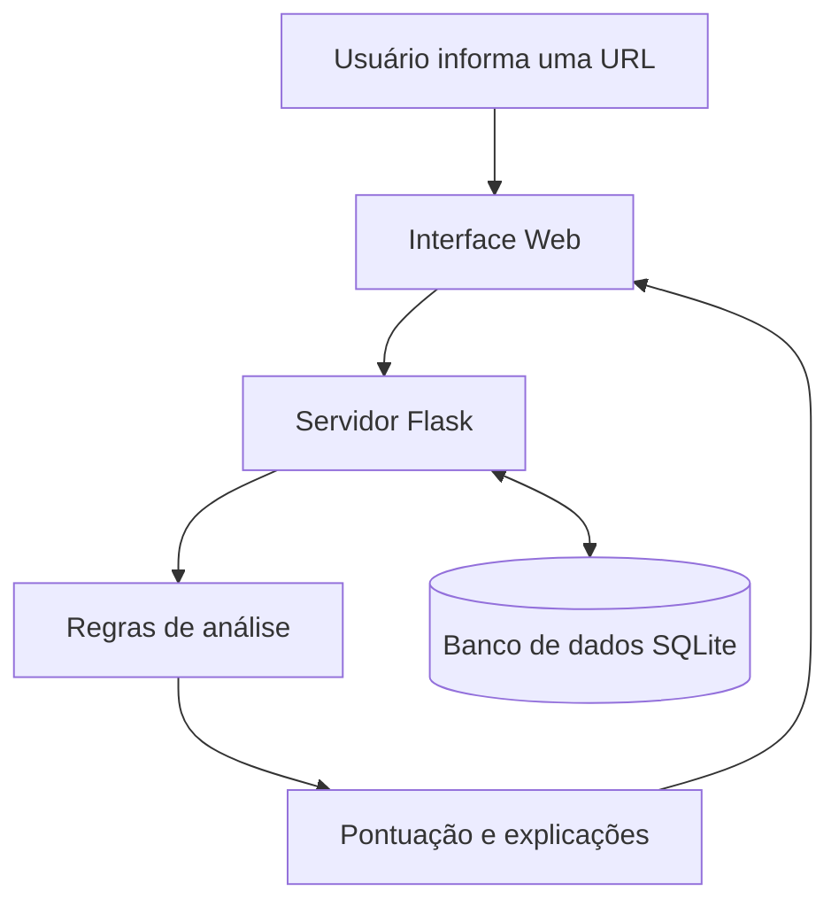

# Etapa 01 — Proposta e Especificação do Projeto

## 1. Nome da aplicação

**AnalisaLink**

## 2. Descrição do problema

Muitas pessoas recebem links por e-mail, redes sociais ou aplicativos de mensagens e não sabem identificar quando um endereço apresenta características suspeitas.

Elementos como o uso de um endereço IP no lugar do domínio, palavras relacionadas a login ou uma extensão de arquivo executável podem passar despercebidos.

O AnalisaLink será uma aplicação Web educativa que analisará a estrutura de uma URL sem acessar o site. A aplicação mostrará os sinais de atenção encontrados e explicará por que cada um deles pode representar um risco.

A análise não garantirá que um endereço seja seguro ou malicioso. Seu objetivo será apenas orientar o usuário por meio de regras básicas de segurança.

## 3. Público-alvo

O público-alvo será formado por usuários da internet com pouco conhecimento em segurança digital e estudantes iniciantes da área de tecnologia.

## 4. Objetivo principal da aplicação

O objetivo principal da aplicação será ajudar o usuário a reconhecer características comuns de links suspeitos antes de acessá-los.

## 5. Funcionalidades

A aplicação deverá possuir as seguintes funcionalidades:

1. Receber uma URL informada pelo usuário;
2. Separar e mostrar o protocolo, o domínio e o caminho da URL;
3. Verificar a presença de características suspeitas;
4. Calcular uma pontuação de atenção para o endereço analisado;
5. Explicar os sinais encontrados na análise;
6. Salvar as análises realizadas;
7. Exibir o histórico de análises;
8. Permitir a exclusão de uma análise do histórico.

Inicialmente, serão verificadas características como:

- Uso de HTTP em vez de HTTPS;
- Presença do caractere `@`;
- Uso de endereço IP no lugar de um domínio;
- URL muito longa;
- Quantidade excessiva de subdomínios;
- Palavras como `login`, `senha`, `conta`, `verify` e `urgente`;
- Extensões de arquivos como `.exe`, `.bat`, `.scr` e `.apk`.

## 6. Entidades ou conceitos importantes

### Análise

Representa uma URL analisada. Terá informações como identificador, URL, pontuação, classificação e data da análise.

### Regra de análise

Representa uma característica que deverá ser procurada na URL. Terá informações como nome, descrição, nível de atenção e pontuação.

### Resultado encontrado

Representa uma regra que foi identificada durante uma análise e a explicação que será apresentada ao usuário.

## 7. Telas ou interfaces

### Tela inicial

Apresentará uma breve explicação sobre a aplicação, um campo para inserir a URL e o botão **Analisar**. Também informará que o endereço não será acessado durante a análise.

### Tela de resultado

Mostrará a URL informada, suas partes principais, a pontuação de atenção, a classificação e a explicação de cada característica encontrada.

### Tela de histórico

Apresentará as análises feitas anteriormente, mostrando a URL, a data, a pontuação e a classificação. O usuário poderá abrir os detalhes ou excluir um registro.

## 8. Operações da aplicação

A aplicação deverá permitir as seguintes operações:

1. Criar uma nova análise;
2. Separar os componentes da URL;
3. Aplicar as regras de análise;
4. Calcular a pontuação de atenção;
5. Salvar o resultado;
6. Consultar o histórico;
7. Consultar os detalhes de uma análise;
8. Excluir uma análise.

## 9. Tecnologias utilizadas no cliente

No cliente, pretende-se utilizar:

- HTML;
- CSS;
- JavaScript;
- Bootstrap.

## 10. Tecnologias utilizadas no servidor

No servidor, pretende-se utilizar:

- Python;
- Flask;
- SQLAlchemy.

## 11. Tecnologia de persistência

Será utilizado o banco de dados **SQLite** para armazenar as análises realizadas e seus resultados.

## 12. Visão geral da solução

O usuário informará uma URL pela interface Web. O servidor receberá o endereço e aplicará as regras de análise.

Depois disso, a aplicação calculará a pontuação, salvará o resultado no banco de dados e apresentará as informações ao usuário.

## Limitações iniciais

- A aplicação não acessará o site informado;
- A aplicação não garantirá que uma URL seja segura ou maliciosa;
- A pontuação será baseada apenas nas regras definidas no projeto;
- Poderão ocorrer falsos positivos e falsos negativos.
